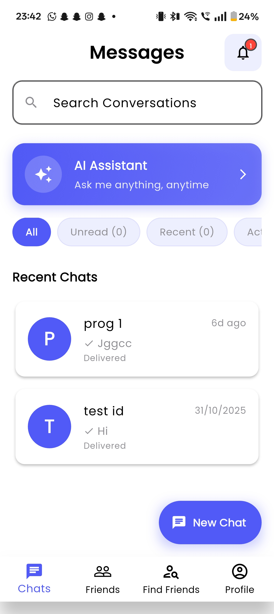
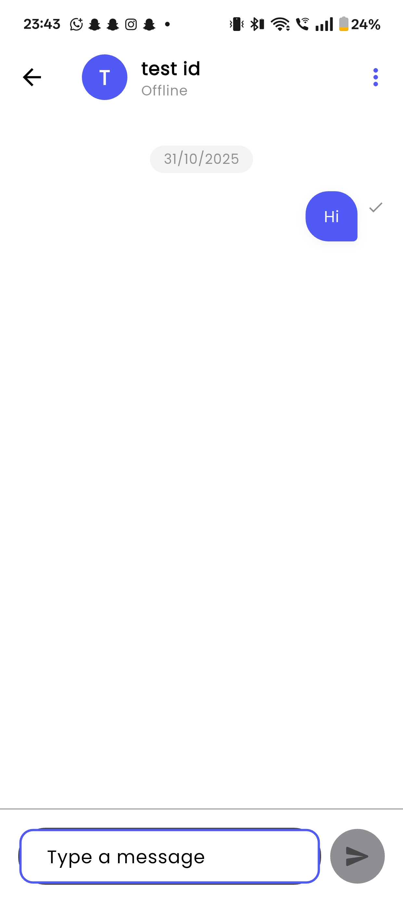
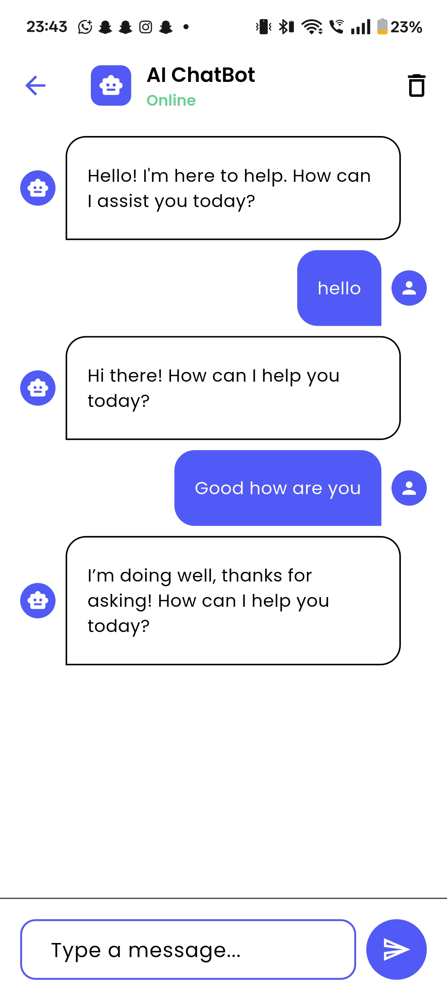
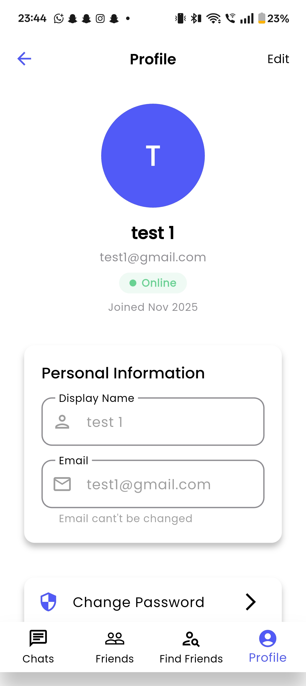
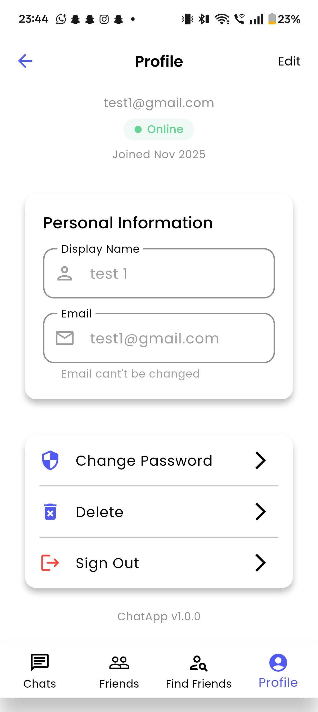

# Chatify – AI-Powered Real-Time Chat App 🚀

[](https://flutter.dev)
[](https://dart.dev)
[](https://firebase.google.com)
[](https://pub.dev/packages/get)
[](https://opensource.org/licenses/MIT)

**Chatify** is a **cross-platform real-time chat application** built with **Flutter**, **Dart**, **Firebase**, and **GetX**. It supports secure user authentication, friend management, AI chatbot integration, push notifications, and a polished UI with seamless navigation.

👉 **Live Demo**: [github.com/sahiltha123/Chatify](https://github.com/sahiltha123/Chatify)  
📅 **Released**: 2025

---

## ✨ Key Features

| Feature | Description |
|--------|-------------|
| **Real-Time Messaging** | Powered by **Firebase Firestore** – instant sync across devices |
| **Firebase Authentication** | Secure email/password login & account management |
| **Friend System** | Add, search, block/unblock friends |
| **AI Chatbot** | Integrated **AI Assistant** card for smart replies & queries |
| **Notifications** | Push notifications for new messages & friend requests |
| **Message Filters** | Unread, active chats, search messages |
| **Profile Management** | Edit profile, change password, delete account |
| **Optimized UI/UX** | Bottom navigation, smooth transitions, responsive design |
| **State Management** | Efficient & reactive with **GetX** |
| **Scalable Backend** | Handles **1000+ concurrent user interactions** |

---

## 📱 Screenshots

<div align="center">
  
  
  
  
  
</div>
---

## 🛠 Tech Stack

- **Framework**: [Flutter](https://flutter.dev) (Cross-platform: iOS, Android, Web)
- **Language**: [Dart](https://dart.dev)
- **State Management**: [GetX](https://pub.dev/packages/get)
- **Backend**: [Firebase Authentication](https://firebase.google.com/products/auth), [Cloud Firestore](https://firebase.google.com/products/firestore)
- **Notifications**: Firebase Cloud Messaging (FCM)
- **AI Integration**: Custom AI Assistant widget (expandable via API)

---

## 🚀 Getting Started

### Prerequisites

- [Flutter SDK](https://flutter.dev/docs/get-started/install) (`>=3.24.0`)
- [Dart SDK](https://dart.dev/get-dart)
- Firebase project (Authentication + Firestore + FCM)

### Installation

1. **Clone the repository**
   ```bash
   git clone https://github.com/sahiltha123/Chatify.git
   cd Chatify
   